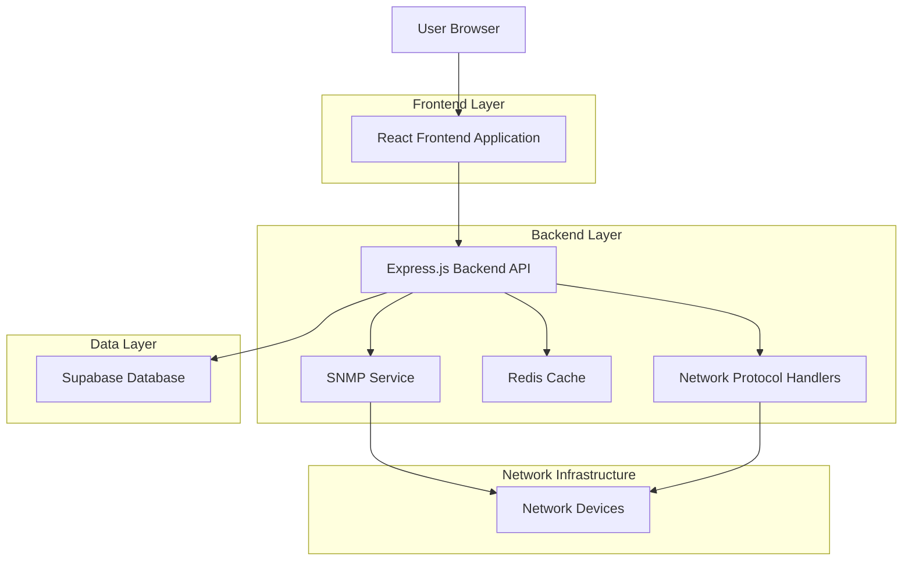
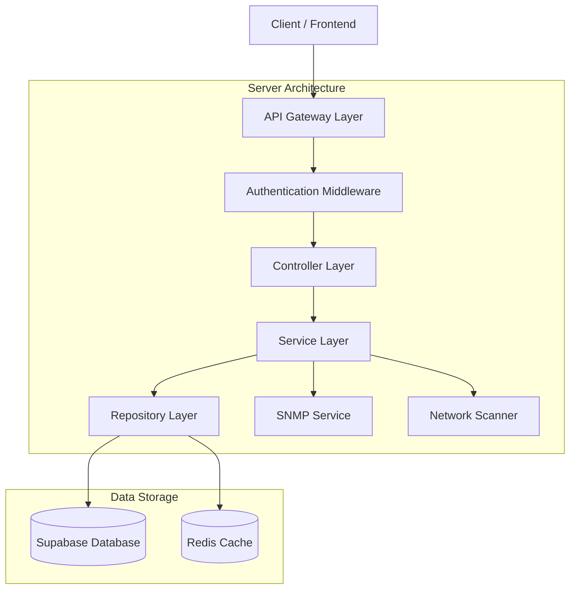
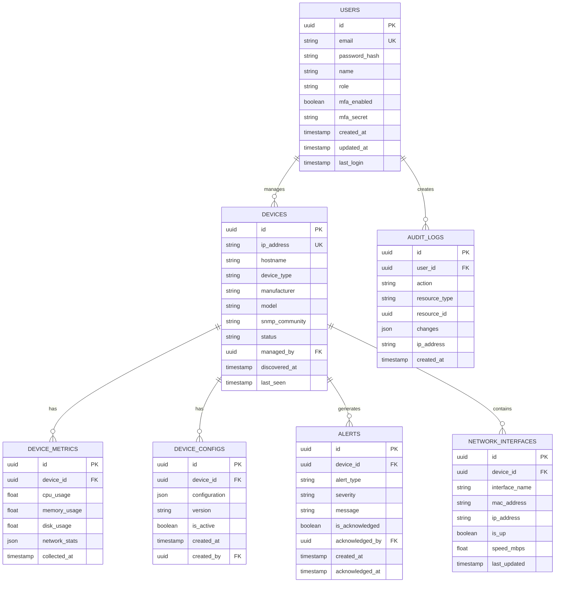

## 1. Architecture design



## 2. Technology Description

- **Frontend**: React@18 + TypeScript + TailwindCSS@3 + Vite
- **Initialization Tool**: vite-init
- **Backend**: Express.js@4 + TypeScript + Socket.io para real-time
- **Database**: Supabase (PostgreSQL) para dados de configuração, logs e métricas
- **Cache**: Redis@7 para dados de monitoramento em tempo real
- **Protocolos**: SNMP@3, ICMP, TCP/IP, WebSocket para comunicação em tempo real

## 3. Route definitions

| Route | Purpose |
|-------|---------|
| / | Dashboard Principal, visão geral da infraestrutura de rede |
| /login | Página de autenticação com suporte a MFA |
| /monitoring | Monitoramento em tempo real com mapa de rede e métricas |
| /devices | Gerenciamento de dispositivos, inventário e configurações |
| /reports | Relatórios de performance e análise de tendências |
| /settings | Configurações do sistema, usuários e segurança |
| /api/auth/* | Endpoints de autenticação e autorização |
| /api/devices/* | CRUD de dispositivos e configurações |
| /api/monitoring/* | Dados de monitoramento e métricas em tempo real |
| /api/reports/* | Geração e exportação de relatórios |
| /api/network/* | Comunicação com dispositivos via SNMP/ICMP |

## 4. API definitions

### 4.1 Authentication APIs

```
POST /api/auth/login
```

Request:
| Param Name | Param Type | isRequired | Description |
|------------|------------|------------|-------------|
| username | string | true | Email do usuário |
| password | string | true | Senha (hash SHA256) |
| mfa_code | string | false | Código MFA se habilitado |

Response:
| Param Name | Param Type | Description |
|------------|------------|-------------|
| token | string | JWT token para autenticação |
| refresh_token | string | Token para renovação de sessão |
| user | object | Dados do usuário autenticado |
| expires_in | number | Tempo de expiração do token |

### 4.2 Device Management APIs

```
GET /api/devices
```

Request (Query Parameters):
| Param Name | Param Type | isRequired | Description |
|------------|------------|------------|-------------|
| page | number | false | Página para paginação (default: 1) |
| limit | number | false | Itens por página (default: 50) |
| status | string | false | Filtrar por status (online/offline/unknown) |
| type | string | false | Filtrar por tipo de dispositivo |

Response:
| Param Name | Param Type | Description |
|------------|------------|-------------|
| devices | array[] | Lista de dispositivos |
| total | number | Total de dispositivos |
| page | number | Página atual |
| pages | number | Total de páginas |

```
POST /api/devices/discover
```

Request:
| Param Name | Param Type | isRequired | Description |
|------------|------------|------------|-------------|
| network_range | string | true | Range de IP (ex: 192.168.1.0/24) |
| snmp_community | string | false | Comunidade SNMP (default: public) |
| timeout | number | false | Timeout em segundos (default: 30) |

### 4.3 Monitoring APIs

```
GET /api/monitoring/realtime/{device_id}
```

Response:
| Param Name | Param Type | Description |
|------------|------------|-------------|
| device_id | string | ID do dispositivo |
| cpu_usage | number | Uso de CPU em porcentagem |
| memory_usage | number | Uso de memória em porcentagem |
| network_stats | object | Estatísticas de rede (bytes in/out) |
| interfaces | array[] | Status das interfaces de rede |
| timestamp | string | Timestamp da coleta |

## 5. Server architecture diagram



## 6. Data model

### 6.1 Data model definition



### 6.2 Data Definition Language

**Users Table**
```sql
-- create table
CREATE TABLE users (
    id UUID PRIMARY KEY DEFAULT gen_random_uuid(),
    email VARCHAR(255) UNIQUE NOT NULL,
    password_hash VARCHAR(255) NOT NULL,
    name VARCHAR(100) NOT NULL,
    role VARCHAR(20) NOT NULL CHECK (role IN ('admin', 'operator_level1', 'operator_level2')),
    mfa_enabled BOOLEAN DEFAULT false,
    mfa_secret VARCHAR(32),
    created_at TIMESTAMP WITH TIME ZONE DEFAULT NOW(),
    updated_at TIMESTAMP WITH TIME ZONE DEFAULT NOW(),
    last_login TIMESTAMP WITH TIME ZONE
);

-- create indexes
CREATE INDEX idx_users_email ON users(email);
CREATE INDEX idx_users_role ON users(role);

-- grant permissions
GRANT SELECT ON users TO anon;
GRANT ALL PRIVILEGES ON users TO authenticated;
```

**Devices Table**
```sql
-- create table
CREATE TABLE devices (
    id UUID PRIMARY KEY DEFAULT gen_random_uuid(),
    ip_address INET UNIQUE NOT NULL,
    hostname VARCHAR(255),
    device_type VARCHAR(50) NOT NULL,
    manufacturer VARCHAR(100),
    model VARCHAR(100),
    snmp_community VARCHAR(100) DEFAULT 'public',
    status VARCHAR(20) DEFAULT 'unknown' CHECK (status IN ('online', 'offline', 'unknown')),
    managed_by UUID REFERENCES users(id),
    discovered_at TIMESTAMP WITH TIME ZONE DEFAULT NOW(),
    last_seen TIMESTAMP WITH TIME ZONE
);

-- create indexes
CREATE INDEX idx_devices_ip ON devices(ip_address);
CREATE INDEX idx_devices_status ON devices(status);
CREATE INDEX idx_devices_type ON devices(device_type);
CREATE INDEX idx_devices_managed_by ON devices(managed_by);

-- grant permissions
GRANT SELECT ON devices TO anon;
GRANT ALL PRIVILEGES ON devices TO authenticated;
```

**Device Metrics Table**
```sql
-- create table
CREATE TABLE device_metrics (
    id UUID PRIMARY KEY DEFAULT gen_random_uuid(),
    device_id UUID NOT NULL REFERENCES devices(id) ON DELETE CASCADE,
    cpu_usage FLOAT CHECK (cpu_usage >= 0 AND cpu_usage <= 100),
    memory_usage FLOAT CHECK (memory_usage >= 0 AND memory_usage <= 100),
    disk_usage FLOAT CHECK (disk_usage >= 0 AND disk_usage <= 100),
    network_stats JSONB,
    collected_at TIMESTAMP WITH TIME ZONE DEFAULT NOW()
);

-- create indexes
CREATE INDEX idx_metrics_device_id ON device_metrics(device_id);
CREATE INDEX idx_metrics_collected_at ON device_metrics(collected_at DESC);
CREATE INDEX idx_metrics_device_time ON device_metrics(device_id, collected_at DESC);

-- grant permissions
GRANT SELECT ON device_metrics TO anon;
GRANT ALL PRIVILEGES ON device_metrics TO authenticated;
```

**Alerts Table**
```sql
-- create table
CREATE TABLE alerts (
    id UUID PRIMARY KEY DEFAULT gen_random_uuid(),
    device_id UUID NOT NULL REFERENCES devices(id) ON DELETE CASCADE,
    alert_type VARCHAR(50) NOT NULL,
    severity VARCHAR(20) NOT NULL CHECK (severity IN ('info', 'warning', 'critical')),
    message TEXT NOT NULL,
    is_acknowledged BOOLEAN DEFAULT false,
    acknowledged_by UUID REFERENCES users(id),
    created_at TIMESTAMP WITH TIME ZONE DEFAULT NOW(),
    acknowledged_at TIMESTAMP WITH TIME ZONE
);

-- create indexes
CREATE INDEX idx_alerts_device_id ON alerts(device_id);
CREATE INDEX idx_alerts_severity ON alerts(severity);
CREATE INDEX idx_alerts_created_at ON alerts(created_at DESC);
CREATE INDEX idx_alerts_unack ON alerts(is_acknowledged) WHERE is_acknowledged = false;

-- grant permissions
GRANT SELECT ON alerts TO anon;
GRANT ALL PRIVILEGES ON alerts TO authenticated;
```

**Row Level Security (RLS) Policies**
```sql
-- Enable RLS
ALTER TABLE devices ENABLE ROW LEVEL SECURITY;
ALTER TABLE device_metrics ENABLE ROW LEVEL SECURITY;
ALTER TABLE alerts ENABLE ROW LEVEL SECURITY;
ALTER TABLE device_configs ENABLE ROW LEVEL SECURITY;

-- Policies for devices
CREATE POLICY "Users can view all devices" ON devices FOR SELECT TO authenticated USING (true);
CREATE POLICY "Only admins can modify devices" ON devices FOR ALL TO authenticated USING (auth.uid() IN (SELECT id FROM users WHERE role = 'admin'));

-- Policies for metrics
CREATE POLICY "Users can view all metrics" ON device_metrics FOR SELECT TO authenticated USING (true);
CREATE POLICY "Only system can insert metrics" ON device_metrics FOR INSERT TO authenticated WITH CHECK (auth.uid() IS NOT NULL);

-- Policies for alerts
CREATE POLICY "Users can view all alerts" ON alerts FOR SELECT TO authenticated USING (true);
CREATE POLICY "Users can acknowledge alerts" ON alerts FOR UPDATE TO authenticated USING (true) WITH CHECK (true);
```