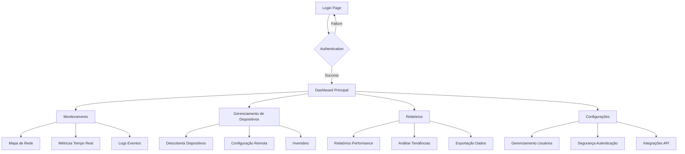

## 1. Product Overview

Plataforma de gerenciamento de rede para monitoramento e administração centralizada de dispositivos de rede. Resolve problemas de visibilidade e controle em redes corporativas, permitindo que administradores monitorem, configurem e analisem o desempenho da infraestrutura de rede em tempo real.

O produto atende administradores de rede e equipes de TI que precisam garantir alta disponibilidade, segurança e performance da infraestrutura de rede empresarial.

## 2. Core Features

### 2.1 User Roles

| Role                  | Registration Method                      | Core Permissions                                                        |
| --------------------- | ---------------------------------------- | ----------------------------------------------------------------------- |
| Administrador de Rede | Email registration + admin approval      | Full access: device management, configuration, monitoring, reports      |
| Operador de Nível 1   | Email registration                       | View-only access: monitoring, basic reports, device status              |
| Operador de Nível 2   | Email registration + supervisor approval | Limited configuration: device status change, basic settings, monitoring |

### 2.2 Feature Module

A plataforma de gerenciamento de rede consiste nos seguintes módulos principais:

1. **Dashboard Principal**: visualização geral da rede, status dos dispositivos, alertas críticos.
2. **Monitoramento em Tempo Real**: mapa de rede, métricas de performance, logs de eventos.
3. **Gerenciamento de Dispositivos**: descoberta automática, configuração remota, inventário.
4. **Relatórios e Análises**: relatórios de desempenho, análise de tendências, exportação de dados.
5. **Configurações do Sistema**: gerenciamento de usuários, políticas de segurança, integrações.

### 2.3 Page Details

| Page Name                     | Module Name               | Feature description                                                                                |
| ----------------------------- | ------------------------- | -------------------------------------------------------------------------------------------------- |
| Dashboard Principal           | Visão Geral da Rede       | Exibir status de todos os dispositivos, consumo de banda, alertas ativos e mapa topológico da rede |
| Dashboard Principal           | Widgets de Performance    | Mostrar gráficos de CPU, memória, tráfego de rede com atualização em tempo real                    |
| Monitoramento                 | Mapa de Rede              | Visualizar dispositivos em mapa interativo com cores indicando status (verde/vermelho/amarelo)     |
| Monitoramento                 | Métricas em Tempo Real    | Exibir gráficos de latência, perda de pacotes, taxa de erro com intervalo de 5 segundos            |
| Monitoramento                 | Logs de Eventos           | Listar eventos críticos, warnings e informações com filtro por data, dispositivo e severidade      |
| Gerenciamento de Dispositivos | Descoberta de Rede        | Executar varredura automática para identificar novos dispositivos via SNMP e ICMP                  |
| Gerenciamento de Dispositivos | Configuração Remota       | Aplicar configurações em lote, backup/restore de configurações, versionamento                      |
| Gerenciamento de Dispositivos | Inventário                | Listar todos os dispositivos com informações detalhadas (IP, MAC, fabricante, modelo, firmware)    |
| Relatórios                    | Relatórios de Desempenho  | Gerar relatórios de disponibilidade, utilização de links, performance por período                  |
| Relatórios                    | Análise de Tendências     | Criar gráficos de evolução temporal com dados históricos de até 12 meses                           |
| Relatórios                    | Exportação de Dados       | Exportar relatórios em PDF, CSV, Excel com templates personalizáveis                               |
| Configurações                 | Gerenciamento de Usuários | Criar/editar/excluir usuários, definir roles e permissões, histórico de acessos                    |
| Configurações                 | Segurança e Autenticação  | Configurar LDAP/AD integração, políticas de senha, autenticação de dois fatores                    |
| Configurações                 | Integrações de API        | Gerenciar tokens de API, documentação Swagger, limites de requisições                              |
| Login                         | Autenticação              | Validar credenciais, suportar MFA, recuperação de senha, sessão segura                             |

## 3. Core Process

### Fluxo do Administrador de Rede

1. Login com autenticação multifator
2. Acesso ao Dashboard Principal para visão geral da infraestrutura
3. Navegação para Monitoramento em Tempo Real para análise de problemas
4. Gerenciamento de Dispositivos para configuração e manutenção
5. Geração de Relatórios para análise de performance
6. Configuração de alertas e políticas de segurança

### Fluxo do Operador de Nível 1

1. Login com credenciais básicas
2. Visualização do Dashboard com informações limitadas
3. Monitoramento de status dos dispositivos
4. Acesso a relatórios pré-configurados
5. Geração de tickets para problemas identificados

### Fluxo do Operador de Nível 2

1. Login com credenciais expandidas
2. Acesso ao Dashboard e Monitoramento
3. Alteração de status básicos de dispositivos
4. Execução de comandos simples remotamente
5. Geração de relatórios personalizados

## 4. User Interface Design

### 4.1 Design Style

* **Cores Primárias**: Azul escuro (#1e3a8a) para header, verde (#10b981) para status ok, vermelho (#ef4444) para crítico

* **Cores Secundárias**: Cinza claro (#f3f4f6) para backgrounds, branco para cards, azul claro (#3b82f6) para ações

* **Botões**: Estilo arredondado com sombra sutil, hover effects suaves

* **Fontes**: Inter para textos, Roboto Mono para dados técnicos (IPs, MACs)

* **Layout**: Card-based com sidebar fixa, top navigation para contexto atual

* **Ícones**: Material Design Icons para consistência, cores semânticas para status

### 4.2 Page Design Overview

| Page Name           | Module Name            | UI Elements                                                                                                                                                   |
| ------------------- | ---------------------- | ------------------------------------------------------------------------------------------------------------------------------------------------------------- |
| Dashboard Principal | Visão Geral            | Grid layout 3x3 com cards de status, gráficos de linha para métricas, cores de status verde/amarelo/vermelho, fonte Inter 14px para labels, 24px para valores |
| Monitoramento       | Mapa de Rede           | Canvas SVG interativo com zoom/pan, nós coloridos por status, tooltips hover com informações detalhadas, sidebar com filtros rápidos                          |
| Gerenciamento       | Inventário             | Tabela responsiva com sorting, paginação 50 itens, barra de busca instantânea, ações em dropdown, status badges coloridos                                     |
| Relatórios          | Análise Tendências     | Gráficos de área com Chart.js, seletor de período, export buttons no topo, legenda inline, responsive para mobile                                             |
| Configurações       | Gerenciamento Usuários | Form com validação em tempo real, tabela de permissões com checkboxes, modal de confirmação para exclusões                                                    |

### 4.3 Responsiveness

* **Desktop-first**: Otimizado para telas 1920x1080, sidebar expandida por padrão

* **Mobile-adaptive**: Layout adaptável para tablets (768px) e smartphones (375px)

* **Touch optimization**: Botões mínimos 44px, gestos de swipe para navegação mobile

* **Breakpoints**: 1200px (desktop), 768px (tablet),

