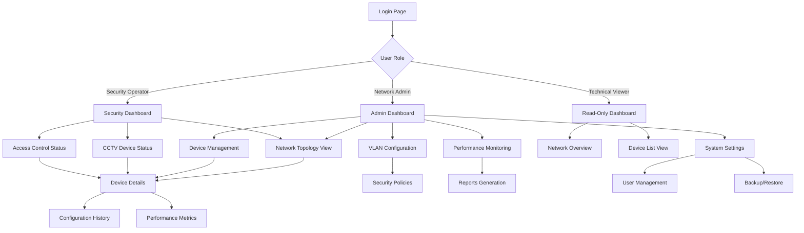

## 1. Product Overview

Sistema de Gerenciamento de Rede Inteligente para o Condomínio Calabasas com visualização avançada de topologia de rede, monitoramento em tempo real e gestão de VLANs. A aplicação fornece uma interface web moderna para visualizar, monitorar e gerenciar toda a infraestrutura de rede segmentada por VLANs do condomínio.

O produto resolve problemas de visualização complexa de redes, facilita o troubleshooting, melhora a segurança através do isolamento de VLANs e permite gerenciamento centralizado de 300+ dispositivos de rede incluindo CFTV, controle de acesso, switches e roteadores.

**Target:** Equipes técnicas de TI, administradores de rede, segurança eletrônica e gestão do condomínio.

## 2. Core Features

### 2.1 User Roles
| Role | Registration Method | Core Permissions |
|------|---------------------|------------------|
| Network Admin | Pre-configured access | Full network management, VLAN configuration, device management |
| Security Operator | Pre-configured access | CFTV and access control device management, read-only network |
| Technical Viewer | Pre-configured access | Read-only access to all network information and reports |
| Guest User | Temporary access | Limited dashboard view, no configuration access |

### 2.2 Feature Module
Aplicação web de gerenciamento de rede com as seguintes páginas principais:

1. **Dashboard Principal:** Visão geral da rede, status dos dispositivos, alertas em tempo real, gráficos de performance
2. **Visualização de Topologia:** Mapa interativo da rede com SVG animado, conexões entre dispositivos, status por VLAN
3. **Gerenciamento de Dispositivos:** Listagem completa com filtros avançados, detalhes de configuração, histórico de alterações
4. **Configuração de VLANs:** Interface de gerenciamento de VLANs, atribuição de portas, políticas de segurança
5. **Monitoramento em Tempo Real:** Gráficos dinâmicos D3.js, análise de tráfego, alertas e notificações
6. **Relatórios e Análises:** Dashboard analítico, exportação de relatórios, histórico de performance
7. **Configurações do Sistema:** Gerenciamento de usuários, backup de configurações, logs de auditoria

### 2.3 Page Details
| Page Name | Module Name | Feature description |
|-----------|-------------|---------------------|
| Dashboard Principal | Cards de Status | Exibir contadores de dispositivos por VLAN, status operacional, alertas pendentes e últimas atualizações em tempo real |
| Dashboard Principal | Gráficos de Performance | Mostrar gráficos de linha com histórico de tráfego, uso de CPU/memória e disponibilidade dos serviços |
| Dashboard Principal | Alertas e Notificações | Sistema de alertas coloridos para falhas de conexão, alterações de configuração e anomalias de segurança |
| Visualização Topologia | Mapa de Rede SVG | Renderizar diagrama interativo da topologia de rede com drag-and-drop, zoom e pan, cores por VLAN |
| Visualização Topologia | Animações de Conexão | Exibir animações de fluxo de dados entre dispositivos, status de links e throughput em tempo real |
| Visualização Topologia | Filtros Dinâmicos | Permitir filtragem por VLAN, tipo de dispositivo, status operacional e localização geográfica |
| Gerenciamento Dispositivos | Tabela de Dispositivos | Listagem completa com paginação, busca global, ordenação e filtros múltiplos por atributos |
| Gerenciamento Dispositivos | Detalhes do Dispositivo | Modal com informações completas: IP, MAC, VLAN, modelo, firmware, portas, conexões e configurações |
| Gerenciamento Dispositivos | Histórico de Alterações | Visualizar timeline de modificações com usuário, timestamp, campo alterado e valores anterior/novo |
| Configuração VLANs | Gerenciamento de VLANs | Interface CRUD completa para VLANs: criar, editar, excluir e visualizar configurações de segurança |
| Configuração VLANs | Atribuição de Portas | Mapeamento visual de switches com drag-and-drop para atribuir portas a VLANs específicas |
| Configuração VLANs | Políticas de Segurança | Configurar ACLs, regras de firewall, QoS e isolamento entre VLANs com interface visual intuitiva |
| Monitoramento Tempo Real | Gráficos D3.js | Dashboard com múltiplos gráficos: série temporal, barras, pizza e gauge para métricas diversas |
| Monitoramento Tempo Real | Análise de Tráfego | Visualizar consumo de banda, protocolos utilizados, top talkers e aplicações principais |
| Monitoramento Tempo Real | Sistema de Alertas | Notificações em tempo real com sons, cores e badges para eventos críticos, avisos e informações |
| Relatórios Análises | Dashboard Analítico | Interface com widgets configuráveis para criar visualizações personalizadas de dados da rede |
| Relatórios Análises | Exportação de Dados | Gerar relatórios em PDF, Excel e CSV com templates pré-definidos e opções de agendamento |
| Configurações Sistema | Gestão de Usuários | CRUD de usuários com roles, permissões granulares, auditoria de acessos e política de senhas |
| Configurações Sistema | Backup e Restore | Agendar backups automáticos, restaurar configurações, exportar/importar dados do sistema |

## 3. Core Process

### Fluxo Principal - Administrador de Rede
1. **Login:** Acessar com credenciais de administrador → Dashboard com visão geral completa
2. **Visualizar Topologia:** Navegar pelo mapa interativo → Identificar problemas ou otimizações → Aplicar filtros por VLAN
3. **Gerenciar Dispositivos:** Selecionar dispositivo específico → Visualizar detalhes e histórico → Realizar alterações se necessário
4. **Configurar VLANs:** Acessar módulo de VLANs → Criar/modificar configurações → Aplicar políticas de segurança
5. **Monitorar Performance:** Ver gráficos em tempo real → Identificar anomalias → Gerar relatórios para análise

### Fluxo - Operador de Segurança
1. **Acesso:** Login com credenciais limitadas → Dashboard focado em CFTV e Controle de Acesso
2. **Monitorar Dispositivos:** Visualizar status de câmeras e leitores → Identificar falhas → Gerar ordens de serviço
3. **Verificar Conexões:** Usar topologia para verificar caminho de rede → Diagnosticar problemas de conectividade

## 4. User Interface Design

### 4.1 Design Style
- **Cores Primárias:** Azul escuro (#1e3a8a) para header, Verde (#10b981) para status OK, Vermelho (#ef4444) para alertas
- **Cores Secundárias:** Cinza claro (#f3f4f6) para backgrounds, Branco para cards e conteúdo
- **Botões:** Estilo arredondado com sombra sutil, hover effects e ícones FontAwesome
- **Fontes:** Inter para textos, Roboto Mono para IPs e códigos técnicos, tamanhos 14-16px para leitura confortável
- **Layout:** Card-based com grid responsivo, navegação lateral fixa, header com breadcrumbs
- **Ícones:** FontAwesome e Feather Icons, estilo outline para consistência visual
- **Animações:** Transições suaves de 200-300ms, loading skeletons, micro-interações nos cards

### 4.2 Page Design Overview
| Page Name | Module Name | UI Elements |
|-----------|-------------|-------------|
| Dashboard Principal | Cards de Status | Cards coloridos com ícones grandes, números em destaque e badges de status com animação de pulsação para alertas |
| Dashboard Principal | Gráficos de Performance | Gráficos de linha com gradientes suaves, tooltips interativos, legendas customizadas e animação de entrada |
| Visualização Topologia | Mapa de Rede SVG | Canvas SVG responsivo com nós coloridos por VLAN, conexões animadas, zoom com mouse wheel e pan com drag |
| Visualização Topologia | Painel de Controle | Sidebar flutuante com toggles para filtros, search box com autocomplete e botões de ação flutuantes |
| Gerenciamento Dispositivos | Tabela de Dados | DataTable com cabeçalho fixo, colunas redimensionáveis, ordenação multi-coluna e ações em dropdown |
| Gerenciamento Dispositivos | Modal de Detalhes | Modal fullscreen com abas organizadas, formulários em grid responsivo e timeline vertical para histórico |
| Configuração VLANs | Interface CRUD | Formulários wizard com validação em tempo real, tabelas editáveis inline e confirmações modais para ações críticas |
| Monitoramento Tempo Real | Dashboard de Gráficos | Grid de widgets arrastáveis, gráficos D3.js com brushes para seleção de período e exportação rápida |
| Relatórios Análises | Gerador de Relatórios | Interface drag-and-drop para selecionar métricas, preview em tempo real e opções de agendamento com calendário |

### 4.3 Responsiveness
- **Desktop-First:** Design otimizado para telas 1920x1080, máximo aproveitamento do espaço horizontal
- **Mobile-Adaptive:** Layout adaptável para tablets (768px+) e smartphones (360px+) com menu hambúrguer
- **Touch-Optimized:** Botões maiores para mobile (44px mínimo), gestos de swipe para navegação entre abas
- **Breakpoints:** 360px, 768px, 1024px, 1440px, 1920px com testes em dispositivos reais
- **Performance:** Lazy loading de imagens, virtual scrolling para listas longas, cache de componentes

## 5. Technical Requirements

### Performance Requirements
- **Loading Time:** < 3 segundos para dashboard principal, < 1 segundo para navegação entre páginas
- **Real-time Updates:** Atualização de status dos dispositivos a cada 30 segundos via WebSocket
- **Data Processing:** Suportar 300+ dispositivos com atualização simultânea sem degradação de performance
- **Concurrent Users:** Mínimo 10 usuários simultâneos com experiência fluida

### Security Requirements
- **Authentication:** JWT tokens com refresh, sessões com timeout automático de 30 minutos
- **Authorization:** RBAC (Role-Based Access Control) com permissões granulares por funcionalidade
- **Data Encryption:** HTTPS obrigatório, senhas hasheadas com bcrypt, dados sensíveis criptografados
- **Audit Trail:** Log completo de todas as ações críticas com timestamp, usuário e IP
- **Network Security:** Validação de entrada contra SQL injection, XSS protection, rate limiting

### Data Requirements
- **Schema Versioning:** Sistema de versionamento de dados para tracking de alterações de configuração
- **Backup Strategy:** Backups automáticos diários com retenção de 30 dias, exportação manual disponível
- **Data Integrity:** Validação de consistência entre dispositivos, validação de ranges de IP
- **Historical Data:** Manter histórico mínimo de 1 ano para análises e relatórios de tendências