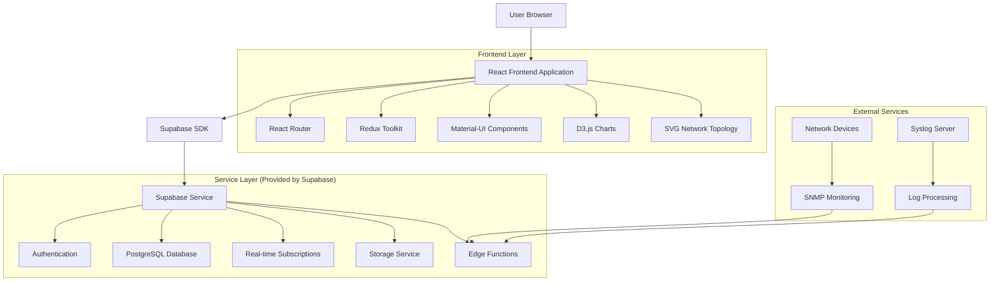
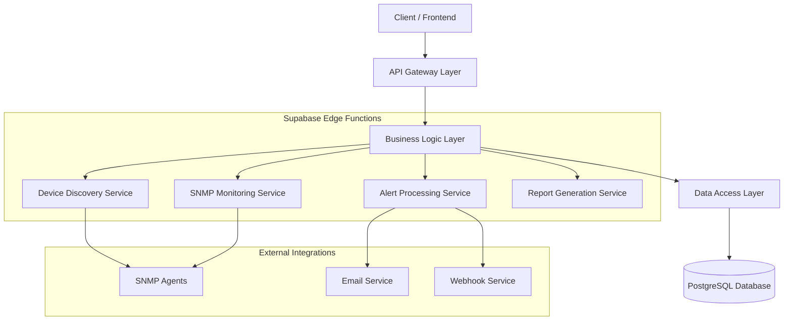
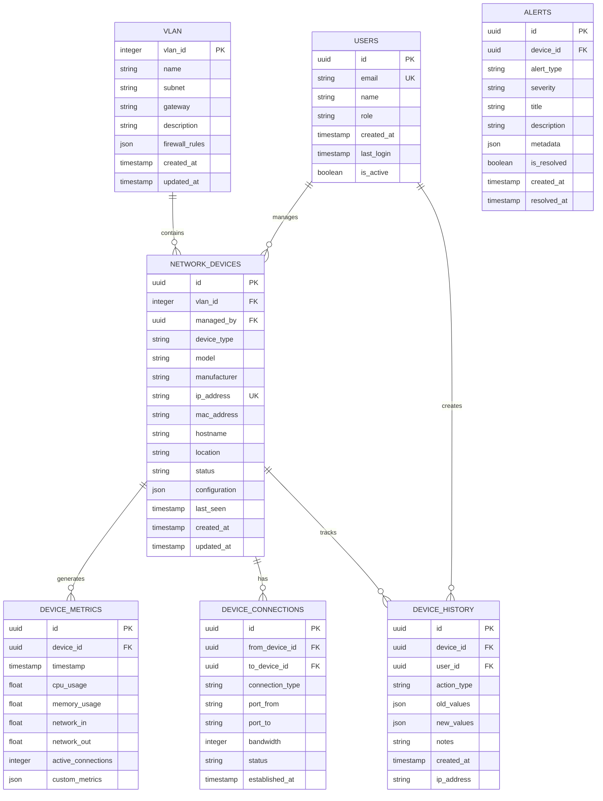

## 1. Architecture design



## 2. Technology Description

- **Frontend:** React@18 + Material-UI@5 + Vite + TypeScript
- **Initialization Tool:** vite-init
- **Backend:** Supabase (Backend-as-a-Service)
- **Database:** PostgreSQL (via Supabase)
- **Real-time:** Supabase Real-time Subscriptions
- **Charts/Visualization:** D3.js@7 + Chart.js@4 + SVG.js
- **State Management:** Redux Toolkit + RTK Query
- **Styling:** Material-UI with custom theme + TailwindCSS
- **Testing:** Jest + React Testing Library + Cypress

## 3. Route definitions

| Route | Purpose |
|-------|---------|
| / | Dashboard principal com visão geral da rede e cards de status |
| /login | Página de autenticação com login seguro via Supabase |
| /topology | Visualização interativa da topologia de rede com SVG animado |
| /devices | Gerenciamento de dispositivos com tabela avançada e filtros |
| /devices/:id | Detalhes completos do dispositivo com histórico de alterações |
| /vlans | Configuração e gerenciamento de VLANs com interface CRUD |
| /monitoring | Dashboard de monitoramento em tempo real com gráficos D3.js |
| /reports | Geração e visualização de relatórios com exportação |
| /settings | Configurações do sistema e gestão de usuários |
| /profile | Perfil do usuário e preferências |

## 4. API definitions

### 4.1 Authentication APIs

**Login**
```
POST /auth/v1/token?grant_type=password
```

Request:
| Param Name | Param Type | isRequired | Description |
|------------|------------|------------|-------------|
| email | string | true | Email do usuário |
| password | string | true | Senha do usuário |

Response:
| Param Name | Param Type | Description |
|------------|------------|-------------|
| access_token | string | JWT token para autenticação |
| refresh_token | string | Token para renovação de sessão |
| user | object | Dados do usuário autenticado |

### 4.2 Network Device APIs

**Get All Devices**
```
GET /rest/v1/network_devices?select=*
```

Query Parameters:
| Param Name | Param Type | isRequired | Description |
|------------|------------|------------|-------------|
| vlan_id | integer | false | Filtrar por VLAN ID |
| device_type | string | false | Filtrar por tipo de dispositivo |
| status | string | false | Filtrar por status (active/inactive) |
| location | string | false | Filtrar por localização |

**Update Device**
```
PATCH /rest/v1/network_devices?id=eq.{device_id}
```

Request Body:
| Param Name | Param Type | isRequired | Description |
|------------|------------|------------|-------------|
| ip_address | string | false | Novo endereço IP |
| status | string | false | Novo status do dispositivo |
| location | string | false | Nova localização |
| notes | string | false | Anotações adicionais |

### 4.3 VLAN Management APIs

**Get VLANs**
```
GET /rest/v1/vlans?select=*
```

**Create VLAN**
```
POST /rest/v1/vlans
```

Request Body:
| Param Name | Param Type | isRequired | Description |
|------------|------------|------------|-------------|
| vlan_id | integer | true | ID da VLAN (10-4094) |
| name | string | true | Nome da VLAN |
| subnet | string | true | Sub-rede (ex: 10.10.10.0/24) |
| gateway | string | true | Gateway IP |
| description | string | false | Descrição da VLAN |

### 4.4 Monitoring APIs

**Get Device Metrics**
```
GET /rest/v1/device_metrics?device_id=eq.{device_id}&order=timestamp.desc&limit=100
```

**Get Network Statistics**
```
GET /rest/v1/network_statistics?select=*&order=timestamp.desc&limit=1
```

## 5. Server architecture diagram



## 6. Data model

### 6.1 Data model definition



### 6.2 Data Definition Language

**Users Table (users)**
```sql
-- create table
CREATE TABLE users (
    id UUID PRIMARY KEY DEFAULT gen_random_uuid(),
    email VARCHAR(255) UNIQUE NOT NULL,
    name VARCHAR(100) NOT NULL,
    role VARCHAR(20) NOT NULL CHECK (role IN ('admin', 'security_operator', 'technical_viewer', 'guest')),
    is_active BOOLEAN DEFAULT true,
    last_login TIMESTAMP WITH TIME ZONE,
    created_at TIMESTAMP WITH TIME ZONE DEFAULT NOW(),
    updated_at TIMESTAMP WITH TIME ZONE DEFAULT NOW()
);

-- create index
CREATE INDEX idx_users_email ON users(email);
CREATE INDEX idx_users_role ON users(role);
CREATE INDEX idx_users_active ON users(is_active);
```

**VLAN Table (vlans)**
```sql
-- create table
CREATE TABLE vlans (
    vlan_id INTEGER PRIMARY KEY,
    name VARCHAR(50) NOT NULL,
    subnet VARCHAR(18) NOT NULL,
    gateway VARCHAR(15) NOT NULL,
    description TEXT,
    firewall_rules JSONB DEFAULT '[]',
    created_at TIMESTAMP WITH TIME ZONE DEFAULT NOW(),
    updated_at TIMESTAMP WITH TIME ZONE DEFAULT NOW()
);

-- insert default VLANs
INSERT INTO vlans (vlan_id, name, subnet, gateway, description) VALUES
(10, 'Management', '10.10.10.0/24', '10.10.10.1', 'Gerenciamento de infraestrutura'),
(20, 'Data', '10.10.20.0/24', '10.10.20.1', 'Rede corporativa'),
(30, 'Voice', '10.10.30.0/24', '10.10.30.1', 'Telefonia IP'),
(40, 'CFTV', '10.10.40.0/24', '10.10.40.1', 'Sistema de CFTV'),
(50, 'Access Control', '10.10.50.0/24', '10.10.50.1', 'Controle de acesso'),
(60, 'IoT', '10.10.60.0/24', '10.10.60.1', 'Dispositivos IoT'),
(100, 'Guest', '10.10.100.0/24', '10.10.100.1', 'WiFi visitantes');
```

**Network Devices Table (network_devices)**
```sql
-- create table
CREATE TABLE network_devices (
    id UUID PRIMARY KEY DEFAULT gen_random_uuid(),
    vlan_id INTEGER NOT NULL REFERENCES vlans(vlan_id),
    managed_by UUID REFERENCES users(id),
    device_type VARCHAR(50) NOT NULL CHECK (device_type IN ('camera', 'nvr', 'switch', 'router', 'firewall', 'access_point', 'reader', 'controller', 'converter')),
    model VARCHAR(100) NOT NULL,
    manufacturer VARCHAR(50) NOT NULL,
    ip_address INET UNIQUE NOT NULL,
    mac_address MACADDR,
    hostname VARCHAR(100),
    location VARCHAR(200),
    status VARCHAR(20) DEFAULT 'active' CHECK (status IN ('active', 'inactive', 'maintenance', 'error')),
    configuration JSONB DEFAULT '{}',
    last_seen TIMESTAMP WITH TIME ZONE,
    created_at TIMESTAMP WITH TIME ZONE DEFAULT NOW(),
    updated_at TIMESTAMP WITH TIME ZONE DEFAULT NOW()
);

-- create indexes
CREATE INDEX idx_network_devices_vlan ON network_devices(vlan_id);
CREATE INDEX idx_network_devices_ip ON network_devices(ip_address);
CREATE INDEX idx_network_devices_status ON network_devices(status);
CREATE INDEX idx_network_devices_type ON network_devices(device_type);
CREATE INDEX idx_network_devices_location ON network_devices(location);
```

**Device Metrics Table (device_metrics)**
```sql
-- create table
CREATE TABLE device_metrics (
    id UUID PRIMARY KEY DEFAULT gen_random_uuid(),
    device_id UUID NOT NULL REFERENCES network_devices(id) ON DELETE CASCADE,
    timestamp TIMESTAMP WITH TIME ZONE DEFAULT NOW(),
    cpu_usage DECIMAL(5,2) DEFAULT 0,
    memory_usage DECIMAL(5,2) DEFAULT 0,
    network_in BIGINT DEFAULT 0,
    network_out BIGINT DEFAULT 0,
    active_connections INTEGER DEFAULT 0,
    custom_metrics JSONB DEFAULT '{}'
);

-- create indexes for performance
CREATE INDEX idx_device_metrics_device ON device_metrics(device_id);
CREATE INDEX idx_device_metrics_timestamp ON device_metrics(timestamp DESC);
CREATE INDEX idx_device_metrics_recent ON device_metrics(device_id, timestamp DESC);

-- partition table by month for better performance
-- CREATE TABLE device_metrics_2024_12 PARTITION OF device_metrics
-- FOR VALUES FROM ('2024-12-01') TO ('2025-01-01');
```

**Device History Table (device_history)**
```sql
-- create table
CREATE TABLE device_history (
    id UUID PRIMARY KEY DEFAULT gen_random_uuid(),
    device_id UUID NOT NULL REFERENCES network_devices(id) ON DELETE CASCADE,
    user_id UUID REFERENCES users(id),
    action_type VARCHAR(50) NOT NULL,
    old_values JSONB DEFAULT '{}',
    new_values JSONB DEFAULT '{}',
    notes TEXT,
    ip_address INET,
    created_at TIMESTAMP WITH TIME ZONE DEFAULT NOW()
);

-- create indexes
CREATE INDEX idx_device_history_device ON device_history(device_id);
CREATE INDEX idx_device_history_user ON device_history(user_id);
CREATE INDEX idx_device_history_created ON device_history(created_at DESC);
CREATE INDEX idx_device_history_action ON device_history(action_type);
```

**Alerts Table (alerts)**
```sql
-- create table
CREATE TABLE alerts (
    id UUID PRIMARY KEY DEFAULT gen_random_uuid(),
    device_id UUID REFERENCES network_devices(id) ON DELETE CASCADE,
    alert_type VARCHAR(50) NOT NULL,
    severity VARCHAR(20) NOT NULL CHECK (severity IN ('info', 'warning', 'critical')),
    title VARCHAR(200) NOT NULL,
    description TEXT,
    metadata JSONB DEFAULT '{}',
    is_resolved BOOLEAN DEFAULT false,
    created_at TIMESTAMP WITH TIME ZONE DEFAULT NOW(),
    resolved_at TIMESTAMP WITH TIME ZONE
);

-- create indexes
CREATE INDEX idx_alerts_device ON alerts(device_id);
CREATE INDEX idx_alerts_severity ON alerts(severity);
CREATE INDEX idx_alerts_resolved ON alerts(is_resolved);
CREATE INDEX idx_alerts_created ON alerts(created_at DESC);
```

### 6.3 Row Level Security (RLS) Policies

**Enable RLS on all tables**
```sql
-- Enable RLS
ALTER TABLE users ENABLE ROW LEVEL SECURITY;
ALTER TABLE network_devices ENABLE ROW LEVEL SECURITY;
ALTER TABLE device_history ENABLE ROW LEVEL SECURITY;
ALTER TABLE alerts ENABLE ROW LEVEL SECURITY;
```

**Users policies**
```sql
-- Users can only see their own profile (except admins)
CREATE POLICY "Users can view own profile" ON users
    FOR SELECT USING (
        auth.uid() = id OR 
        EXISTS (
            SELECT 1 FROM users 
            WHERE id = auth.uid() AND role = 'admin'
        )
    );

-- Only admins can update users
CREATE POLICY "Only admins can update users" ON users
    FOR UPDATE USING (
        EXISTS (
            SELECT 1 FROM users 
            WHERE id = auth.uid() AND role = 'admin'
        )
    );
```

**Network Devices policies**
```sql
-- All authenticated users can view devices
CREATE POLICY "Authenticated users can view devices" ON network_devices
    FOR SELECT TO authenticated
    USING (true);

-- Only admins and security operators can update devices
CREATE POLICY "Authorized users can update devices" ON network_devices
    FOR UPDATE TO authenticated
    USING (
        EXISTS (
            SELECT 1 FROM users 
            WHERE id = auth.uid() AND role IN ('admin', 'security_operator')
        )
    );

-- Only admins can insert/delete devices
CREATE POLICY "Only admins can modify device structure" ON network_devices
    FOR ALL TO authenticated
    USING (
        EXISTS (
            SELECT 1 FROM users 
            WHERE id = auth.uid() AND role = 'admin'
        )
    );
```

### 6.4 Grant Permissions

```sql
-- Grant basic read access to anon role for public data
GRANT SELECT ON vlans TO anon;
GRANT SELECT ON network_devices TO anon;

-- Grant full access to authenticated role
GRANT ALL PRIVILEGES ON ALL TABLES IN SCHEMA public TO authenticated;
GRANT ALL PRIVILEGES ON ALL SEQUENCES IN SCHEMA public TO authenticated;

-- Grant usage on schema
GRANT USAGE ON SCHEMA public TO anon, authenticated;
```

## 7. Real-time Features

### 7.1 WebSocket Connections
- **Device Status Updates:** Notificações em tempo real quando dispositivos mudam de status
- **Alert Notifications:** Alertas críticos são enviados instantaneamente para usuários online
- **Configuration Changes:** Notificações quando configurações de dispositivos são alteradas

### 7.2 Real-time Subscriptions
```javascript
// Example subscription for device status changes
const subscription = supabase
  .from('network_devices')
  .on('UPDATE', payload => {
    console.log('Device updated:', payload.new)
    updateDeviceInUI(payload.new)
  })
  .subscribe()
```

## 8. Performance Optimization

### 8.1 Database Optimization
- **Indexes:** Índices otimizados para queries frequentes por VLAN, status, tipo e localização
- **Partitioning:** Tabelas de métricas particionadas por mês para melhor performance
- **Caching:** Implementação de cache Redis para queries frequentes e dados de dashboard

### 8.2 Frontend Optimization
- **Code Splitting:** Lazy loading de componentes e páginas para reduzir bundle size
- **Virtual Scrolling:** Para listas grandes de dispositivos (>100 itens)
- **Image Optimization:** SVG para ícones e gráficos, lazy loading para imagens
- **Service Worker:** Cache offline para dados críticos e funcionalidade básica

### 8.3 API Optimization
- **Pagination:** Todas as listas com paginação server-side
- **Field Selection:** Queries otimizadas selecionando apenas campos necessários
- **Batch Operations:** Updates em lote para múltiplos dispositivos
- **Connection Pooling:** Pool de conexões otimizado para PostgreSQL