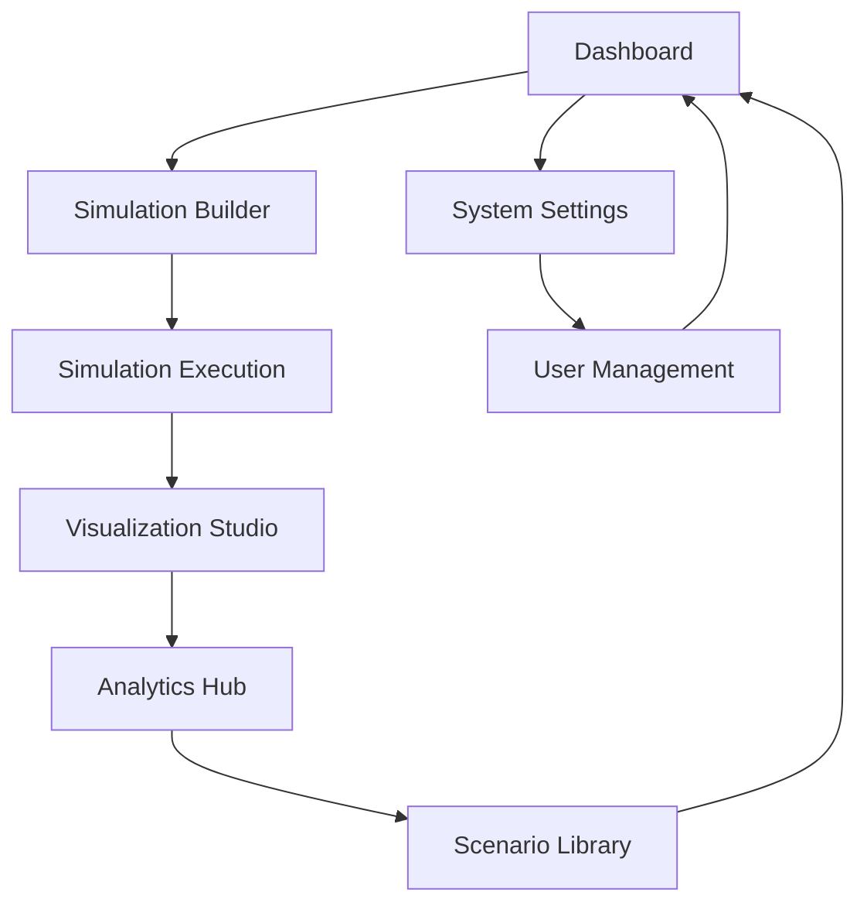

## 1. Product Overview
A comprehensive simulation system that models and analyzes complex real-world scenarios with configurable parameters, real-time visualization, and detailed analytics. The system enables researchers, analysts, and decision-makers to simulate various scenarios, test hypotheses, and gain insights through data-driven modeling.

The simulation platform helps organizations reduce risk, optimize processes, and make informed decisions by providing accurate scenario modeling and predictive analysis capabilities.

## 2. Core Features

### 2.1 User Roles
| Role | Registration Method | Core Permissions |
|------|---------------------|------------------|
| Simulation Analyst | Email registration | Create/edit simulations, view results, export data |
| System Administrator | Admin invitation | Full system access, user management, system configuration |
| Viewer/Stakeholder | Email invitation | View simulation results, access reports |

### 2.2 Feature Module
Our simulation system consists of the following main pages:
1. **Dashboard**: simulation overview, quick access to recent simulations, system status monitoring.
2. **Simulation Builder**: parameter configuration, model selection, scenario setup, validation tools.
3. **Visualization Studio**: real-time charts, 3D models, interactive graphs, export options.
4. **Analytics Hub**: data analysis tools, performance metrics, comparative studies, report generation.
5. **Scenario Library**: saved simulations, template management, version control, sharing capabilities.
6. **System Settings**: user management, system configuration, integration settings, backup/restore.

### 2.3 Page Details
| Page Name | Module Name | Feature description |
|-----------|-------------|---------------------|
| Dashboard | Overview Panel | Display active simulations, recent activities, system resource usage with real-time updates |
| Dashboard | Quick Actions | Create new simulation, access templates, view notifications, system alerts |
| Dashboard | Performance Monitor | Show CPU/memory usage, simulation progress, queue status, error logs |
| Simulation Builder | Parameter Editor | Configure simulation parameters with validation, range checking, dependency management |
| Simulation Builder | Model Selection | Choose from predefined models, upload custom models, configure model-specific settings |
| Simulation Builder | Scenario Designer | Define initial conditions, boundary constraints, input data sources, validation rules |
| Simulation Builder | Validation Tools | Run pre-simulation checks, validate parameters, verify model integrity |
| Visualization Studio | Real-time Charts | Live data visualization, multiple chart types, customizable dashboards, zoom/pan controls |
| Visualization Studio | 3D Renderer | Three-dimensional model visualization, camera controls, lighting options, export capabilities |
| Visualization Studio | Interactive Controls | Play/pause simulations, adjust speed, step-through mode, parameter tweaking |
| Analytics Hub | Data Analysis | Statistical analysis, trend identification, correlation studies, hypothesis testing |
| Analytics Hub | Performance Metrics | Track simulation accuracy, execution time, resource consumption, convergence rates |
| Analytics Hub | Report Generator | Create comprehensive reports, custom templates, automated report scheduling |
| Scenario Library | Simulation Gallery | Browse saved simulations, search/filter capabilities, preview thumbnails |
| Scenario Library | Template Management | Create/share templates, version control, access permissions, categorization |
| Scenario Library | Collaboration | Share simulations, comment system, review workflows, approval processes |
| System Settings | User Management | Add/remove users, role assignment, permission management, activity logs |
| System Settings | Configuration | System-wide settings, integration endpoints, backup schedules, performance tuning |

## 3. Core Process

### Regular User Flow
Users begin at the Dashboard where they can monitor system status and access recent simulations. From there, they navigate to the Simulation Builder to create new simulations by configuring parameters, selecting models, and defining scenarios. Once configured, simulations run in the background while users monitor progress through the Visualization Studio. Results are analyzed in the Analytics Hub, and successful simulations can be saved to the Scenario Library for future reference or sharing.

### System Administrator Flow
Administrators access System Settings to configure the platform, manage users, and monitor system health. They can set up integration endpoints, configure backup schedules, and adjust performance parameters. Administrators also review system logs, manage templates, and oversee collaboration workflows.

## 4. User Interface Design

### 4.1 Design Style
- **Primary Colors**: Deep blue (#1E3A8A) for headers, bright blue (#3B82F6) for interactive elements
- **Secondary Colors**: Light gray (#F3F4F6) for backgrounds, white for content areas
- **Button Style**: Rounded corners with subtle shadows, hover effects, clear visual states
- **Font**: Inter for body text, Roboto Mono for code/data display
- **Layout Style**: Card-based design with responsive grid system, collapsible sidebars
- **Icons**: Material Design icons for consistency, custom icons for simulation-specific actions

### 4.2 Page Design Overview
| Page Name | Module Name | UI Elements |
|-----------|-------------|-------------|
| Dashboard | Overview Panel | Card-based layout with live counters, progress bars, status indicators using blue/gray color scheme |
| Simulation Builder | Parameter Editor | Tabbed interface with input fields, sliders, dropdowns, real-time validation feedback |
| Visualization Studio | Real-time Charts | Responsive chart containers, legend toggles, data point tooltips, export buttons |
| Analytics Hub | Data Analysis | Data tables with sorting/filtering, statistical summary cards, correlation matrices |
| Scenario Library | Simulation Gallery | Grid layout with thumbnail previews, search bar, filter sidebar, action buttons |

### 4.3 Responsiveness
Desktop-first design approach with mobile-adaptive layouts. Touch interaction optimization for tablet users. Responsive breakpoints at 768px and 1024px with collapsible navigation and adaptive content scaling.