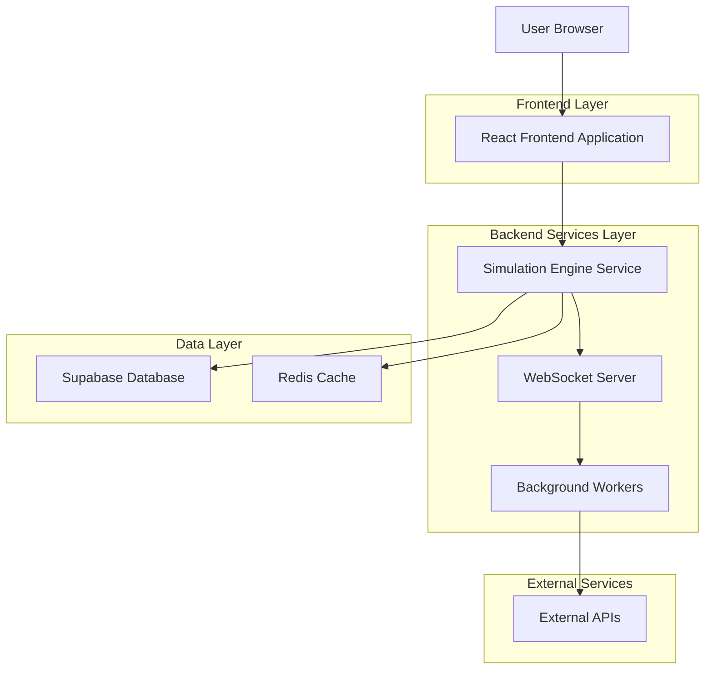
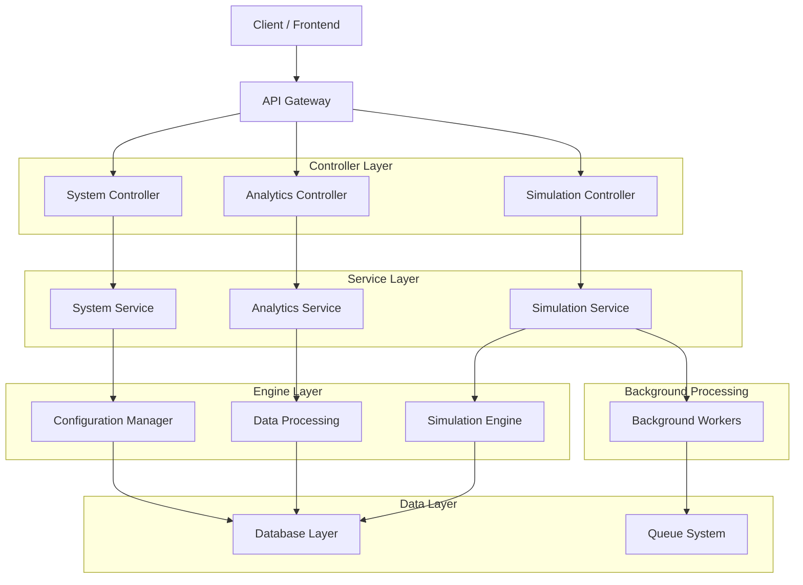
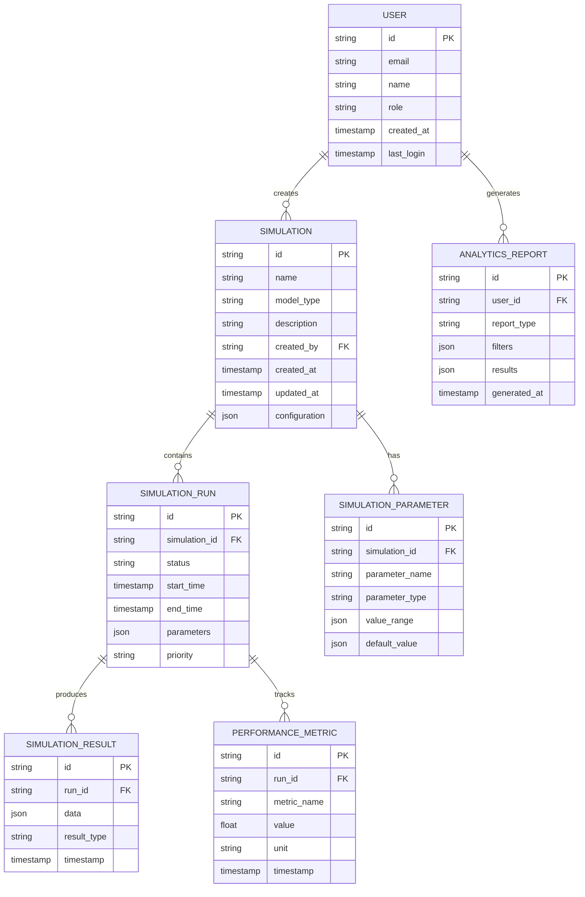

## 1. Architecture design



## 2. Technology Description

* **Frontend**: React\@18 + TypeScript + TailwindCSS\@3 + Vite

* **Initialization Tool**: vite-init

* **Backend**: Node.js\@18 + Express\@4 + Socket.io

* **Database**: Supabase (PostgreSQL)

* **Cache**: Redis

* **State Management**: Redux Toolkit + RTK Query

* **Visualization**: D3.js + Three.js + Chart.js

* **Testing**: Jest + React Testing Library + Supertest

## 3. Route definitions

| Route                 | Purpose                                               |
| --------------------- | ----------------------------------------------------- |
| /                     | Dashboard - Main overview and system status           |
| /simulation/builder   | Simulation Builder - Create and configure simulations |
| /simulation/visualize | Visualization Studio - Real-time data visualization   |
| /analytics            | Analytics Hub - Data analysis and reporting           |
| /scenarios            | Scenario Library - Saved simulations and templates    |
| /settings             | System Settings - Configuration and user management   |
| /api/simulations      | Simulation management API endpoints                   |
| /api/analytics        | Analytics and reporting API endpoints                 |
| /api/system           | System configuration and monitoring endpoints         |

## 4. API definitions

### 4.1 Core API

#### Create Simulation

```
POST /api/simulations/create
```

Request:

| Param Name        | Param Type | isRequired | Description              |
| ----------------- | ---------- | ---------- | ------------------------ |
| name              | string     | true       | Simulation name          |
| modelType         | string     | true       | Type of simulation model |
| parameters        | object     | true       | Simulation parameters    |
| initialConditions | object     | false      | Initial state conditions |

Response:

| Param Name        | Param Type | Description                          |
| ----------------- | ---------- | ------------------------------------ |
| simulationId      | string     | Unique simulation identifier         |
| status            | string     | Simulation status                    |
| estimatedDuration | number     | Estimated completion time in seconds |

Example:

```json
{
  "name": "Traffic Flow Analysis",
  "modelType": "traffic_simulation",
  "parameters": {
    "vehicleCount": 1000,
    "roadLength": 5000,
    "speedLimit": 60
  },
  "initialConditions": {
    "trafficDensity": 0.3,
    "weather": "clear"
  }
}
```

#### Get Simulation Results

```
GET /api/simulations/:id/results
```

Response:

| Param Name   | Param Type | Description               |
| ------------ | ---------- | ------------------------- |
| simulationId | string     | Simulation identifier     |
| status       | string     | Current simulation status |
| results      | object     | Simulation output data    |
| metrics      | object     | Performance metrics       |
| timestamp    | string     | Completion timestamp      |

#### Start Simulation

```
POST /api/simulations/:id/start
```

Request:

| Param Name | Param Type | isRequired | Description                    |
| ---------- | ---------- | ---------- | ------------------------------ |
| realTime   | boolean    | false      | Enable real-time visualization |
| priority   | string     | false      | Queue priority level           |

#### Get Analytics Data

```
GET /api/analytics/summary
```

Query Parameters:

| Param Name    | Param Type | isRequired | Description                    |
| ------------- | ---------- | ---------- | ------------------------------ |
| dateRange     | string     | false      | Time period for analysis       |
| simulationIds | array      | false      | Filter by specific simulations |
| metrics       | array      | false      | Specific metrics to include    |

## 5. Server architecture diagram



## 6. Data model

### 6.1 Data model definition



### 6.2 Data Definition Language

#### Users Table

```sql
-- create users table
CREATE TABLE users (
    id UUID PRIMARY KEY DEFAULT gen_random_uuid(),
    email VARCHAR(255) UNIQUE NOT NULL,
    name VARCHAR(100) NOT NULL,
    role VARCHAR(20) DEFAULT 'analyst' CHECK (role IN ('analyst', 'admin', 'viewer')),
    created_at TIMESTAMP WITH TIME ZONE DEFAULT NOW(),
    last_login TIMESTAMP WITH TIME ZONE,
    is_active BOOLEAN DEFAULT true
);

-- create index
CREATE INDEX idx_users_email ON users(email);
CREATE INDEX idx_users_role ON users(role);
```

#### Simulations Table

```sql
-- create simulations table
CREATE TABLE simulations (
    id UUID PRIMARY KEY DEFAULT gen_random_uuid(),
    name VARCHAR(255) NOT NULL,
    model_type VARCHAR(100) NOT NULL,
    description TEXT,
    created_by UUID REFERENCES users(id),
    created_at TIMESTAMP WITH TIME ZONE DEFAULT NOW(),
    updated_at TIMESTAMP WITH TIME ZONE DEFAULT NOW(),
    configuration JSONB NOT NULL,
    is_template BOOLEAN DEFAULT false,
    is_public BOOLEAN DEFAULT false
);

-- create index
CREATE INDEX idx_simulations_created_by ON simulations(created_by);
CREATE INDEX idx_simulations_model_type ON simulations(model_type);
CREATE INDEX idx_simulations_created_at ON simulations(created_at DESC);
```

#### Simulation Runs Table

```sql
-- create simulation_runs table
CREATE TABLE simulation_runs (
    id UUID PRIMARY KEY DEFAULT gen_random_uuid(),
    simulation_id UUID REFERENCES simulations(id) ON DELETE CASCADE,
    status VARCHAR(50) DEFAULT 'pending' CHECK (status IN ('pending', 'running', 'completed', 'failed', 'cancelled')),
    start_time TIMESTAMP WITH TIME ZONE,
    end_time TIMESTAMP WITH TIME ZONE,
    parameters JSONB,
    priority VARCHAR(20) DEFAULT 'normal' CHECK (priority IN ('low', 'normal', 'high', 'urgent')),
    error_message TEXT,
    resource_usage JSONB
);

-- create index
CREATE INDEX idx_simulation_runs_simulation_id ON simulation_runs(simulation_id);
CREATE INDEX idx_simulation_runs_status ON simulation_runs(status);
CREATE INDEX idx_simulation_runs_priority ON simulation_runs(priority);
```

#### Simulation Results Table

```sql
-- create simulation_results table
CREATE TABLE simulation_results (
    id UUID PRIMARY KEY DEFAULT gen_random_uuid(),
    run_id UUID REFERENCES simulation_runs(id) ON DELETE CASCADE,
    data JSONB NOT NULL,
    result_type VARCHAR(50) NOT NULL,
    timestamp TIMESTAMP WITH TIME ZONE DEFAULT NOW(),
    file_path VARCHAR(500),
    file_size BIGINT
);

-- create index
CREATE INDEX idx_simulation_results_run_id ON simulation_results(run_id);
CREATE INDEX idx_simulation_results_result_type ON simulation_results(result_type);
CREATE INDEX idx_simulation_results_timestamp ON simulation_results(timestamp DESC);
```

#### Performance Metrics Table

```sql
-- create performance_metrics table
CREATE TABLE performance_metrics (
    id UUID PRIMARY KEY DEFAULT gen_random_uuid(),
    run_id UUID REFERENCES simulation_runs(id) ON DELETE CASCADE,
    metric_name VARCHAR(100) NOT NULL,
    value FLOAT NOT NULL,
    unit VARCHAR(20),
    timestamp TIMESTAMP WITH TIME ZONE DEFAULT NOW(),
    metadata JSONB
);

-- create index
CREATE INDEX idx_performance_metrics_run_id ON performance_metrics(run_id);
CREATE INDEX idx_performance_metrics_metric_name ON performance_metrics(metric_name);
CREATE INDEX idx_performance_metrics_timestamp ON performance_metrics(timestamp DESC);
```

#### Row Level Security Policies

```sql
-- Enable RLS
ALTER TABLE simulations ENABLE ROW LEVEL SECURITY;
ALTER TABLE simulation_runs ENABLE ROW LEVEL SECURITY;
ALTER TABLE simulation_results ENABLE ROW LEVEL SECURITY;

-- Grant basic read access to anon role
GRANT SELECT ON simulations TO anon;
GRANT SELECT ON simulation_runs TO anon;
GRANT SELECT ON simulation_results TO anon;

-- Grant full access to authenticated role
GRANT ALL PRIVILEGES ON simulations TO authenticated;
GRANT ALL PRIVILEGES ON simulation_runs TO authenticated;
GRANT ALL PRIVILEGES ON simulation_results TO authenticated;
GRANT ALL PRIVILEGES ON performance_metrics TO authenticated;

-- Create policies for simulations
CREATE POLICY "Users can view their own simulations" ON simulations
    FOR SELECT USING (auth.uid() = created_by OR is_public = true);

CREATE POLICY "Users can create simulations" ON simulations
    FOR INSERT WITH CHECK (auth.uid() = created_by);

CREATE POLICY "Users can update their own simulations" ON simulations
    FOR UPDATE USING (auth.uid() = created_by);

CREATE POLICY "Users can delete their own simulations" ON simulations
    FOR DELETE USING (auth.uid() = created_by);
```

