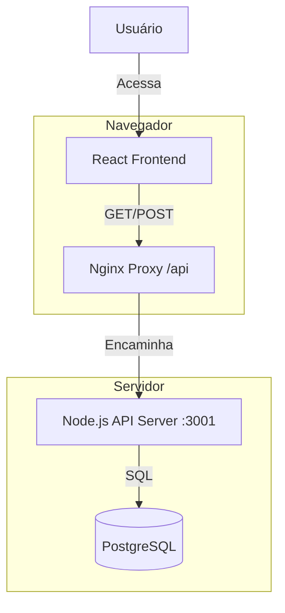

# 🛠️ Análise e Solução: Falha no Cadastro de Equipamentos

## 🔍 Diagnóstico do Problema

### O Que Estava Acontecendo?
O usuário relatou que os dispositivos não apareciam na lista, mesmo após a importação ou cadastro manual parecerem funcionar (logs de sucesso no backend).

### Causa Raiz
Havia uma **desconexão completa entre o Backend e o Frontend**:

1.  **Backend (Real):** O servidor API (`import-api.cjs`) estava conectando corretamente ao PostgreSQL e inserindo/atualizando os dados. Por isso os logs mostravam sucesso.
2.  **Frontend (Mock):** O frontend (React) estava usando um cliente `supabase` configurado em "modo local" (`NoopBuilder`).
3.  **O Problema:** Este cliente `NoopBuilder` era apenas um "dummy". Quando o frontend pedia a lista de dispositivos (`.select('*')`), ele retornava **sempre uma lista vazia `[]`**, ignorando completamente os dados reais que estavam no PostgreSQL.

Basicamente: O backend escrevia no banco de dados, mas o frontend lia de uma "caixa vazia".

---

## ✅ Solução Implementada

Para resolver isso, implementamos uma **Arquitetura Full-Stack Local**:

### 1. 🚀 Backend Expandido (API Server)
Transformamos o servidor de importação em uma API completa (CRUD):
- `GET /api/network_devices` - Lista todos os dispositivos (ordenados)
- `POST /api/network_devices` - Cria um novo dispositivo
- `PUT /api/network_devices/:id` - Atualiza dispositivo existente
- `DELETE /api/network_devices/:id` - Remove dispositivo
- `GET /api/vlans` - Lista VLANs para o formulário

### 2. 🌉 Ponte Frontend-Backend (`api.ts`)
Criamos um serviço dedicado no frontend (`src/services/api.ts`) que substitui o cliente Supabase. Este serviço fala diretamente com nossa API local.

### 3. 🔄 Atualização dos Componentes
Reescrevemos a lógica de dados nas páginas:
- **Inventory.tsx:** Agora busca a lista real de dispositivos via API.
- **InventoryForm.tsx:** Agora cria e edita dispositivos via API, e busca NVRs/VLANs reais.

---

## 🧪 Como Testar a Solução

### 1. Limpe o Cache
É crucial limpar o cache do navegador para carregar o novo frontend:
- Pressione `Ctrl + F5` ou `Ctrl + Shift + R`.

### 2. Verifique a Lista
Ao carregar a página de Inventário, você deve ver imediatamente os dispositivos que já estavam no banco de dados (aqueles 4 da importação de teste).

### 3. Teste o Cadastro Manual
1. Clique em "Adicionar Dispositivo".
2. Preencha os dados (ex: Serial: `MANUAL-01`, IP: `192.168.10.10`, Modelo: `TESTE`).
3. Salve.
4. O dispositivo deve aparecer na lista imediatamente.

### 4. Teste a Importação
1. Clique em "Importar Planilha".
2. Selecione um arquivo.
3. Importe.
4. Os novos dispositivos aparecerão na lista.

---

## 📊 Arquitetura Final

**Status:** ✅ **Resolvido e Deployado**
